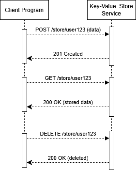

# JSON Key-Value Store Microservice

## Overview
This microservice provides a simple JSON-based key-value store using a REST API. Clients can store, retrieve, and delete key-value pairs programmatically.

## API Example

### Request
Request to store a key value in the microservice with an HTTP request
- **Method:** `POST`
- **Endpoint:** `/store/{key}`
- **Request Body (JSON):**
  ```json
  {
      "value": <any JSON-serializable value>
  }
  ```
- **Response:** `201 Created`

#### Example Call (Python)
```python
import requests

url = "http://localhost:8000/store/user123"
data = {"value": {"name": "Alice", "age": 30}}
response = requests.post(url, json=data)
print(response.status_code)  # Should return 201
```

### Receive
Receive requested data from the microservice from the HTTP response

- **Method:** `GET`
- **Endpoint:** `/store/{key}`
- **Response Body (JSON):**
  ```json
  {
      "value": <stored JSON value>
  }
  ```
- **Response Codes:**
  - `200 OK`: Successful retrieval
  - `404 Not Found`: Key does not exist

#### Example Call (Python)
```python
import requests

url = "http://localhost:8000/store/user123"
response = requests.get(url)
if response.status_code == 200:
    print(response.json())  # Should return stored data
else:
    print("Item not found")
```

## UML Sequence Diagram



